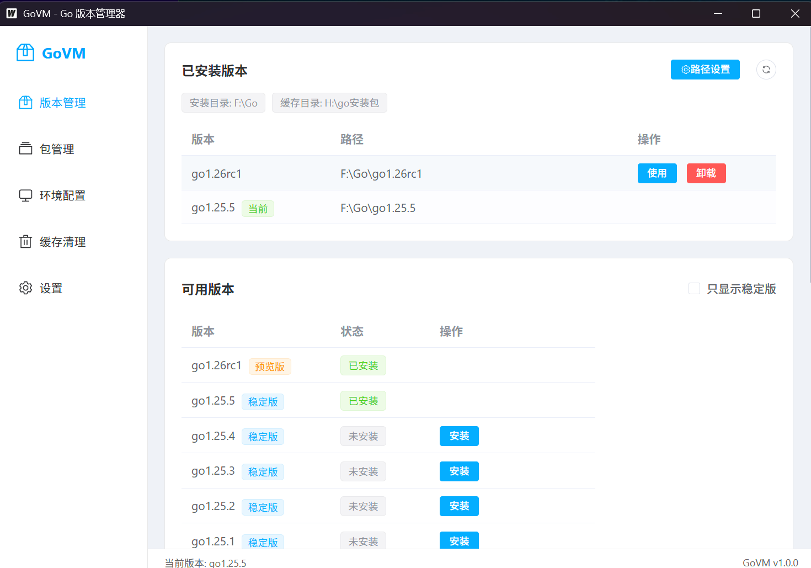

# GoVM - Go 版本管理器

<p align="center">
  
</p>

<p align="center">
  <strong>一个简洁美观的 Go 语言版本管理工具</strong>
</p>

<p align="center">
  <a href="#功能特性">功能特性</a> •
  <a href="#下载安装">下载安装</a> •
  <a href="#使用说明">使用说明</a> •
  <a href="#自行编译">自行编译</a> •
  <a href="#常见问题">常见问题</a>
</p>

---

## 功能特性

### 🔄 版本管理
- 在线获取 Go 官方版本列表（稳定版/测试版）
- 一键下载安装任意版本
- 快速切换已安装的版本
- 支持自定义安装目录

### 📦 包管理
- 搜索热门 Go 第三方包
- 一键下载包到本地缓存
- 查看已下载的模块列表
- 支持 GOPATH 共享/隔离两种模式
- 区分官方包和第三方包

### ⚙️ 环境配置
- 可视化管理 GOROOT、GOPATH、GOPROXY、GOBIN
- 环境诊断，一键检测配置问题
- 快速修复常见环境问题

### 🗑️ 缓存清理
- 查看下载缓存和模块缓存占用
- 一键清理释放磁盘空间

### 🎨 其他特性
- 支持多镜像源（官方、阿里云、中科大）
- 浅色/深色主题切换
- 单文件运行，无需安装
- 纯本地运行，无需联网账号

---

## 下载安装

### 直接下载

点击下载最新版本：

**[⬇️ 下载 GoVM.exe](https://github.com/ccx0058/GoVM/releases/latest/download/govm.exe)**

或前往 [Releases 页面](https://github.com/ccx0058/GoVM/releases) 查看所有版本。

### 系统要求

- Windows 10 / Windows 11
- WebView2 运行时（Windows 10/11 通常已自带，如未安装请 [点击下载](https://developer.microsoft.com/en-us/microsoft-edge/webview2/)）

### 使用方式

1. 下载 `govm.exe` 到任意目录
2. 双击运行即可
3. 首次使用建议在「设置」中配置镜像源为「官方中国」或「阿里云」

---

## 使用说明

### 版本管理

1. 打开「版本管理」页面
2. 在「可用版本」列表中选择需要的版本，点击「安装」
3. 安装完成后，在「已安装版本」中点击「使用」切换到该版本
4. 底部状态栏显示当前使用的 Go 版本

### 包管理

1. 打开「包管理」页面
2. 点击「安装包」按钮，搜索需要的包（如 gin、gorm、redis）
3. 点击「下载」将包缓存到本地
4. 已下载的包会显示在列表中，支持按分类筛选

### 环境配置

1. 打开「环境配置」页面
2. 查看当前环境变量配置
3. 点击「开始诊断」检测环境问题
4. 如有问题，点击「修复」一键修复

### GOPATH 模式

- **共享模式**：所有 Go 版本共用一个 GOPATH，包只需下载一次
- **隔离模式**：每个 Go 版本独立 GOPATH，互不影响

---

## 自行编译

### 环境准备

- Go 1.21+
- Node.js 18+
- Wails CLI

```bash
# 安装 Wails CLI
go install github.com/wailsapp/wails/v2/cmd/wails@latest
```

### 编译步骤

```bash
# 进入项目目录
cd govm

# 进入前端目录
cd frontend

# 安装前端依赖
npm install

# 返回上级目录
cd ..

# 编译生产版本
wails build
```

编译完成后，exe 文件在 `govm/build/bin/govm.exe`

### 开发模式

```bash
cd govm
wails dev
```

---

## 配置文件

应用配置存储在用户目录下：

```
C:\Users\用户名\.govm\
├── config.json      # 应用配置（镜像源、主题、路径等）
├── cache/           # Go 安装包下载缓存
└── current          # 当前版本记录
```

Go 版本默认安装到配置的安装目录（可在设置中修改）。

---

## 常见问题

### Q: 打开软件白屏或闪退？
A: 需要安装 WebView2 运行时，[点击下载](https://developer.microsoft.com/en-us/microsoft-edge/webview2/)

### Q: 切换版本后终端还是旧版本？
A: 需要重新打开终端，环境变量才会生效

### Q: 下载速度慢？
A: 在「设置」中将镜像源改为「官方中国」或「阿里云」

### Q: 和官方安装包冲突吗？
A: 不冲突，GoVM 通过修改环境变量切换版本，不影响已有安装

### Q: 配置文件在哪？
A: `C:\Users\用户名\.govm\config.json`

---

## 技术栈

- **后端**：Go + [Wails](https://wails.io/)
- **前端**：Vue 3 + TypeScript + [Element Plus](https://element-plus.org/)
- **打包**：单文件 exe，静态编译，无需运行时

---

## License

[MIT License](LICENSE)

---

## 致谢

- [Wails](https://wails.io/) - Go + Web 桌面应用框架
- [Element Plus](https://element-plus.org/) - Vue 3 UI 组件库
- [Go](https://go.dev/) - 编程语言
